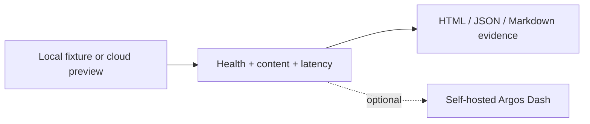

# Argos Pack

**Small, runnable examples for testing what an agent built.**

[Argos framework](https://github.com/lpythu/argos) · [SDK](https://lpythu.github.io/argos/sdk.md) · [Skheri](https://github.com/benchyard/skheri) · [Stack guide](https://github.com/benchyard/stack)

This public example pack checks HTTP health, response time and expected preview
content. It contains no customer endpoints, credentials or internal product cases.
It is a starting point for your own pack, not a copy of an internal acceptance suite.



## Run locally

Python 3.12+ is required. Create a virtual environment and install this pack:

```bash
git clone https://github.com/benchyard/argos-pack.git
cd argos-pack
python3 -m venv .venv
. .venv/bin/activate
pip install -e .
python -m http.server 8765 --bind 127.0.0.1 --directory examples/site
```

In another terminal, activate the same environment and run:

```bash
argos list pack:webdemo
argos run pack:webdemo --env local
argos run web:health --env local --soak --for 30s --pause 2s
```

Open the printed run directory's `report.html`. The same directory contains
structured JSON, Markdown, timings and expected/actual operation evidence.

## Check a Skheri preview

With the Skheri example's port-forward running:

```bash
export ARGOS_BASE_URL=http://127.0.0.1:5173
export ARGOS_EXPECT_TEXT='Preview before commit.'
argos run web:preview --env preview
```

After changing the page, set `ARGOS_EXPECT_TEXT` to the new expected text and rerun.
For the fixture's health case the default path is `/health`; use `ARGOS_HEALTH_PATH`
for a real application's endpoint. `ARGOS_MAX_LATENCY_MS` defaults to 3000.

Outside `--env local`, `ARGOS_BASE_URL` is required. Missing configuration fails;
these cases do not silently skip. Latency thresholds are both recorded **and
asserted**, so exceeding the budget fails the run. No full response body is saved.

For optional team reporting, obtain a connection file from your own Argos Dash and
pass `--dash /path/to/dash.env`. Keep this file outside Git. The local workflow
requires no account, dashboard or model API key.

## Extend and validate

The entry point in `pyproject.toml` registers `argos_examples.pack`. Add cases with
explicit assertions and expected/actual evidence; use the [SDK](https://lpythu.github.io/argos/sdk.md)
as the contract. Keep destructive checks opt-in and environment-specific.

```bash
python -m unittest discover -s tests -v
```

Apache-2.0. See [LICENSE](LICENSE).
